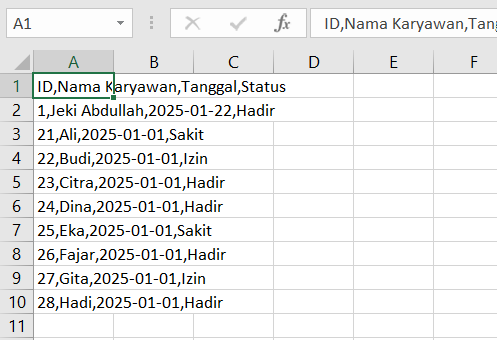

# Aplikasi Kepegawaian 🌟

## Deskripsi Program 📝

Aplikasi ini dirancang untuk mempermudah pengelolaan data kepegawaian, termasuk **karyawan**, **absensi**, dan **proyek**. Aplikasi ini dilengkapi dengan fitur untuk mengelola, menampilkan, dan mengekspor data ke file CSV, serta menyediakan antarmuka pengguna yang sederhana dan intuitif.

## Fitur Utama 🔧

- **Kelola Karyawan**: Menambah, mengedit, menghapus, dan melihat data karyawan.
- **Kelola Absensi**: Menambah, mengedit, menghapus, dan melihat data absensi karyawan.
- **Kelola Proyek**: Menambah, mengedit, menghapus, dan melihat data proyek yang dikerjakan karyawan.
- **Export CSV**: Ekspor data ke file CSV untuk memudahkan penyimpanan dan pemrosesan lebih lanjut.

## Screenshot 📸

### 1. Tampilan Menu Utama


Menu utama aplikasi dengan tombol navigasi ke **Kelola Karyawan**, **Kelola Proyek**, dan **Kelola Absensi**.

### 2. Kelola Karyawan


Form untuk mengelola data karyawan, termasuk penambahan, pengeditan, dan penghapusan data.

### 3. Kelola Absensi


Form untuk mengelola data absensi karyawan, termasuk status kehadiran dan tanggal absensi.

### 4. Kelola Proyek


Form untuk mengelola data proyek yang melibatkan karyawan, termasuk deskripsi, durasi, dan penanggung jawab.

### 5. Export Data ke CSV





Tampilan setelah data diekspor ke file CSV.

## Cara Penggunaan 📖

1. **Kelola Karyawan**:

   - Pilih **Kelola Karyawan** di halaman utama untuk melihat atau mengelola data karyawan.
   - Anda dapat menambahkan, mengedit, atau menghapus data karyawan, serta mengekspor data ke CSV.

2. **Kelola Absensi**:

   - Pilih **Kelola Absensi** untuk mengelola data absensi karyawan.
   - Tambahkan atau edit status absensi karyawan, serta ekspor data absensi.

3. **Kelola Proyek**:

   - Pilih **Kelola Proyek** untuk mengelola proyek yang dikerjakan oleh karyawan.
   - Anda dapat menambah, mengedit, atau menghapus proyek, serta melihat data terkait.

4. **Export CSV**:
   - Gunakan tombol **Export** di setiap form untuk mengekspor data ke file CSV.

## Koneksi Database 💾

Aplikasi ini menggunakan MySQL sebagai database. Untuk menghubungkan aplikasi dengan database, file **Koneksi.java** telah disediakan untuk mengelola koneksi.

- **URL**: `jdbc:mysql://localhost:3306/db_kepegawaian`
- **User**: `root`
- **Password**: (kosong)

Pastikan MySQL berjalan dan database **`db_kepegawaian`** sudah ada pada server lokal Anda.

## Penulis ✍️

- **Nama**: RENDY WIDIANSYAH
- **NPM**: 2210010549
- **Kelas**: 5B TI Reg BJB

## Teknologi yang Digunakan 💻

- **Java**: Bahasa pemrograman utama
- **Swing/AWT**: Framework GUI
- **SQL**: Pengelolaan database
- **CSV**: Format untuk ekspor data

## Requirements 📋

- **Java Development Kit (JDK)** 8 atau lebih tinggi
- **IDE Java** (NetBeans/Eclipse/IntelliJ)
- **Database**: MySQL atau SQLite (tergantung konfigurasi)

### Library pendukung:

- **JFreeChart**
- **JSON Parser**
- **SQLite JDBC**

## Instalasi & Setup 🔧

1. Clone repository ini:
   ```bash
   git clone https://github.com/username/repository-name.git
   ```
